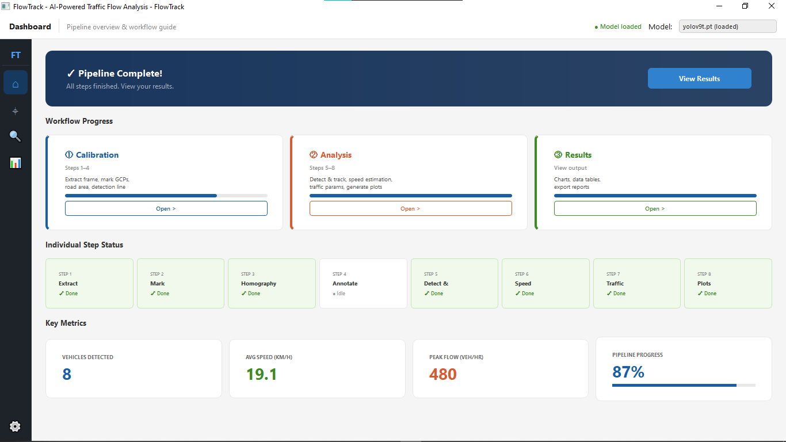
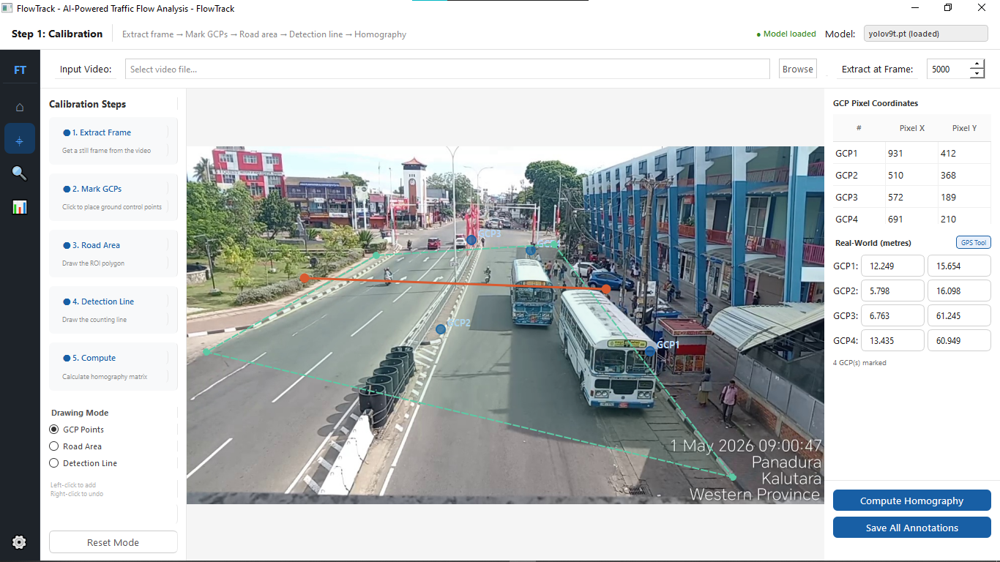
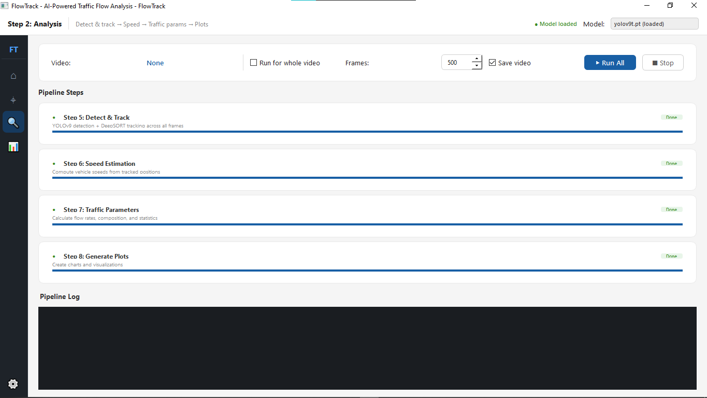
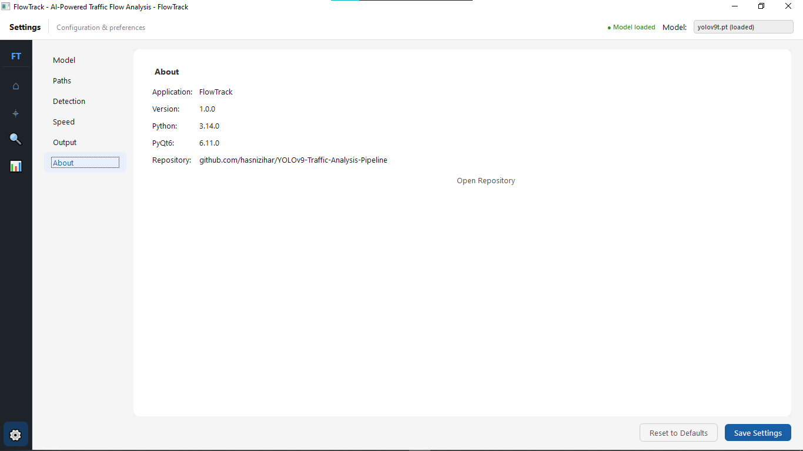
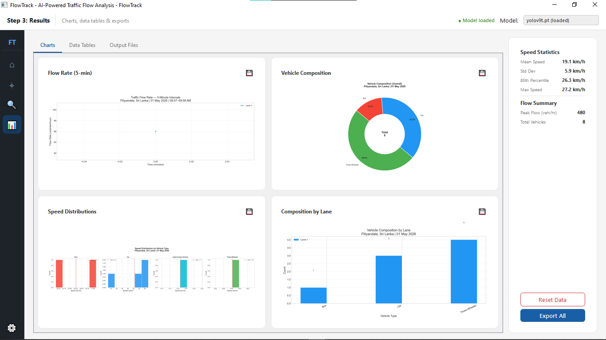

# 🚗 FlowTrack: AI-Powered Traffic Flow Analysis and Vehicle Tracking System


[](https://github.com/hasnizihar/Traffic-Analysis-Pipeline/releases/latest)

A comprehensive, computer-vision-based traffic flow analysis tool powered by **YOLOv9** and **DeepSORT**. Developed by **HASNI ZIHAR** and designed for transportation engineering, this pipeline processes traffic surveillance video to automatically detect, classify, and track vehicles. It extracts vital traffic parameters—such as flow rates, speed distributions, and vehicle composition—and generates publication-quality charts.

---

## ✨ Key Features

- **Advanced Object Detection**: Uses **YOLOv9** (Tiny or Custom) for state-of-the.art vehicle detection.
- **Multi-Object Tracking**: Integrates **DeepSORT** for robust, real-time vehicle tracking across frames.
- **Perspective Correction**: Built-in Homography calibration maps pixel coordinates to real-world metres for accurate speed and distance estimation.
- **Custom Vehicle Classification**: Detects and refines 7 specific vehicle types, including localized categories:
  - Motorcycle
  - Three-Wheeler (Tuk-Tuk)
  - Car
  - Van
  - Light Goods Vehicle
  - Bus
  - Heavy Goods Vehicle
- **Automated Parameter Extraction**: Calculates flow rates (1, 5, 10-minute intervals), vehicle speeds, and lane-wise composition.
- **Publication-Ready Visualization**: Automatically generates pie charts, bar charts, speed histograms, and box plots.
- **Dual Interface**: Operate the pipeline via a modern **PyQt6 Graphical User Interface (GUI)** or a robust **Command-Line Interface (CLI)**.

---

## 📸 Screenshots

### Application Interface

**Dashboard**


**Calibration**


**Analysis Processing**


**Settings**


### Analysis Results

**Data Table**


**Generated Charts**


**Output Files**


---

## ⚙️ Installation & Setup

### 📥 Option 1: Download Windows Installer (Recommended for Users)

You can download the pre-compiled Windows setup file to install FlowTrack without any Python configuration:

**[Download FlowTrack Setup (.exe)](https://github.com/hasnizihar/Traffic-Analysis-Pipeline/releases/latest)**

*Simply run the installer and launch FlowTrack from your desktop!*

### 💻 Option 2: Setup for Development (Python)

#### 1. Clone the Repository

```bash
git clone https://github.com/hasnizihar/Traffic-Analysis-Pipeline.git
cd Traffic-Analysis-Pipeline
```

### 2. Create a Virtual Environment (Recommended)

```bash
python -m venv .venv
# On Windows
.venv\Scripts\activate
# On macOS/Linux
source .venv/bin/activate
```

### 3. Install Dependencies

```bash
pip install -r requirements.txt
```

### 4. Download YOLO Model Weights

Model weights (`.pt` files) are not tracked in this repository due to their size. Place them inside the `models/` directory:

| Model | Size | Best For |
|---|---|---|
| **`yolov9t.pt`** | ~5 MB | CPU / Fast Inference (Recommended) |
| **`yolov9c.pt`** | ~52 MB | GPU / Higher Accuracy |

*Models can be downloaded from the [Ultralytics GitHub Repository](https://github.com/ultralytics/ultralytics).*

### 5. Add Your Video

Place your target traffic recording in the designated directory:
```
data/Raw video/traffic_video.mp4
```

---

## 🚀 Usage

### Option A: Graphical User Interface (Recommended)

The easiest and most interactive way to run the pipeline is through the PyQt6 GUI.

1. Launch the application:
```bash
python run_gui.py
```
2. Navigate through the **Dashboard**, complete the **Calibration** steps (extract frame, mark GCPs, define road area and detection line), run the **Analysis**, and view the generated **Results**.

*Tip: You can also package the GUI into a standalone executable using PyInstaller:*
```bash
pip install pyinstaller
pyinstaller build.spec --clean --noconfirm
```

### Option B: Command Line Interface (CLI)

For headless operation or automation, you can run the pipeline directly via the CLI.

**Phase 1: Interactive Calibration (Run Once)**
```bash
python scripts/step1_extract_frame.py
python scripts/step2_mark_gcps.py        # Interactive UI to mark GCPs, ROI, and lines
python scripts/step3_homography.py       # Computes the perspective correction matrix
python scripts/step4_annotate_frame.py   # Generates a benchmark annotated image
```

**Phase 2: Full Analysis**
```bash
# Run the entire pipeline sequentially (Steps 5 -> 8)
python scripts/run_all.py

# Run for a limited number of frames (useful for testing)
python scripts/step5_detect_track.py --frames 1000
```

---

## 📂 Project Structure

```text
├── data/                                 # Raw data, GPS measurements, and video
├── models/                               # YOLO model weights (.pt files)
├── output/                               # Generated outputs, logs, CSVs, and plots
├── scripts/                              # Core pipeline processing scripts
│   ├── config.py                         # Central configuration and hyperparameters
│   ├── step1_extract_frame.py            # Extracts a calibration frame
│   ├── step2_mark_gcps.py                # UI for marking points/lines
│   ├── step3_homography.py               # Homography computation
│   ├── step4_annotate_frame.py           # Benchmark image generation
│   ├── step5_detect_track.py             # YOLOv9 + DeepSORT core logic
│   ├── step6_speed.py                    # Speed estimation script
│   ├── step7_traffic_params.py           # Traffic parameter calculation
│   ├── step8_plots.py                    # Data visualization generation
│   └── run_all.py                        # Automated CLI pipeline runner
├── traffic_analysis_gui/                 # PyQt6 Application Code
│   ├── main.py                           # GUI entry point
│   ├── assets/                           # UI Stylesheets (QSS)
│   ├── controllers/                      # Application logic and state management
│   ├── gui/                              # Screen layouts and views
│   └── workers/                          # Multithreading workers
├── run_gui.py                            # Easy launcher for the GUI
├── requirements.txt                      # Python dependency list
├── build.spec                            # PyInstaller build configuration
└── README.md                             # Project documentation
```

---

## 📊 Outputs & Results

After a successful run, the `output/` directory will contain everything needed for a comprehensive traffic report:

- **Raw Data**: `vehicle_counts.csv`, `vehicle_speeds.csv`, `track_history.pkl`
- **Analytics**: `flow_1min.csv`, `composition.csv`, `speed_stats.csv`
- **Charts**:
  - `flow_plot_*.png`: Time-series flow rates
  - `composition_pie.png` & `composition_bar.png`: Vehicle distributions
  - `speed_histograms.png` & `speed_boxplot.png`: Statistical speed visualizations
- **Video**: `annotated_output.mp4` (Full video with bounding boxes, tracking IDs, and labels)

---

## 🛠 Built With

- **[YOLOv9](https://github.com/WongKinYiu/yolov9)** - Object Detection
- **[DeepSORT](https://github.com/nwojke/deep_sort)** - Real-Time Object Tracking
- **[OpenCV](https://opencv.org/)** - Computer Vision & Image Processing
- **[PyQt6](https://riverbankcomputing.com/software/pyqt/)** - Graphical User Interface
- **[Pandas](https://pandas.pydata.org/)** & **[NumPy](https://numpy.org/)** - Data Analysis
- **[Matplotlib](https://matplotlib.org/)** - Data Visualization

---

## 📄 License

This project is licensed under the MIT License - see the `LICENSE` file for details.
